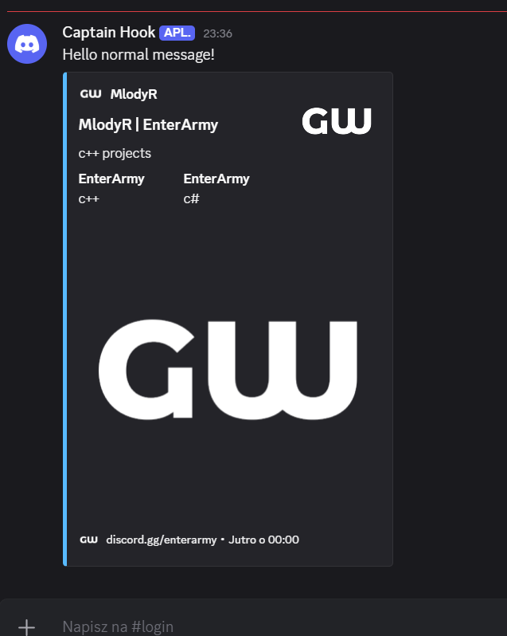
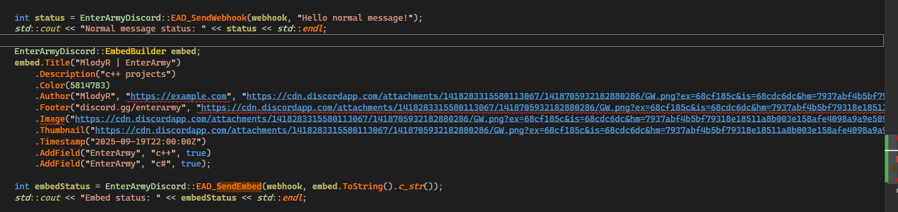
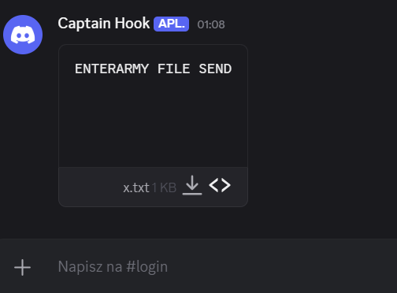

# EnterArmyDiscord-CPP

**EnterArmyDiscord** is a lightweight C++ library for sending Discord messages and rich embeds via webhooks.  

Easy to integrate — just include the header, link the DLL, and you're ready to send messages.  

**This library is actively developed and will continue to receive new features and improvements.**


---

## Project Structure
```
╔════════════════════════════════╗
║ EnterArmyDiscord/              ║
║ ├─ include/                    ║
║ │  └─ EnterArmyDiscord.h       ║
║ ├─ lib/                        ║
║ │  └─ EnterArmyDiscord.lib     ║
║ ├─ bin/                        ║
║ │  └─ EnterArmyDiscord.dll     ║
╚════════════════════════════════╝
```

# Sending

### EMBED
```
    const char* webhook = "https://discord.com/api/webhooks/xxxx/yyyy";

   
    EnterArmyDiscord::EmbedBuilder embed;
    embed.Title("Embed Test")
         .Description("This is a full example embed")
         .Color(5814783)
         .Author("Author Name", "https://example.com", "https://example.com/icon.png")
         .Footer("Footer text", "https://example.com/footer_icon.png")
         .Image("https://example.com/image.png")
         .Thumbnail("https://example.com/thumbnail.png")
         .Timestamp("2025-09-19T22:00:00Z")
         .AddField("Field 1", "Value 1", true)
         .AddField("Field 2", "Value 2", true);

    int embedStatus = EnterArmyDiscord::SendEmbed(webhook, embed.ToString().c_str());
    std::cout << "Embed status: " << embedStatus << std::endl;
```
### Normal message
```
const char* webhook = "https://discord.com/api/webhooks/xxxx/yyyy";

int status = EnterArmyDiscord::SendWebhook(webhook, "Hello normal message!");
```

# Send File
```
const char* webhook = "https://discord.com/api/webhooks/xxxx/yyyy";

int fileStatus = EnterArmyDiscord::SendFile(webhook, "E:\\test.txt", "OPTIONAL MESSAGE");
std::cout << "File status: " << fileStatus << std::endl;
```

## Screenshots

  


